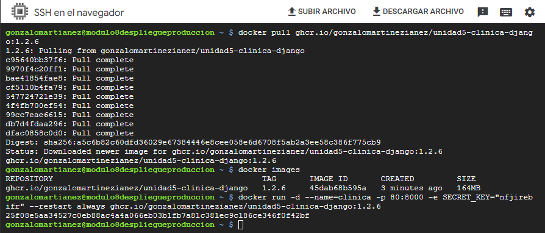
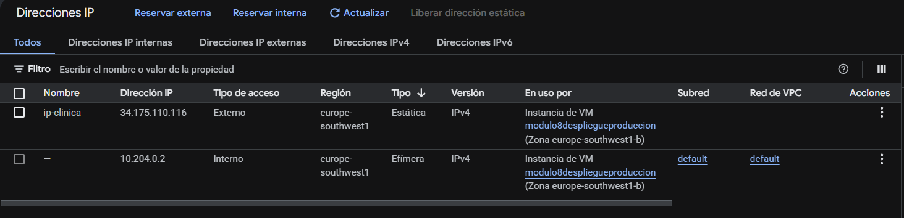
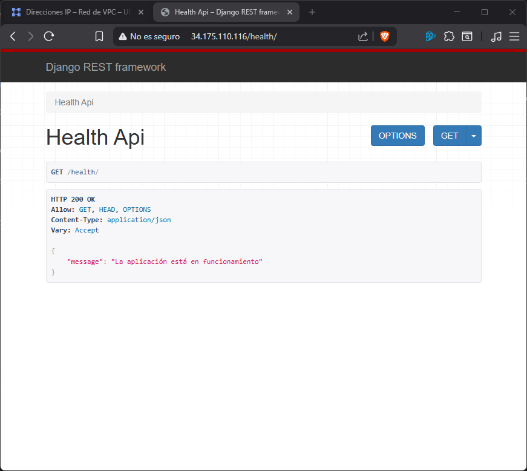
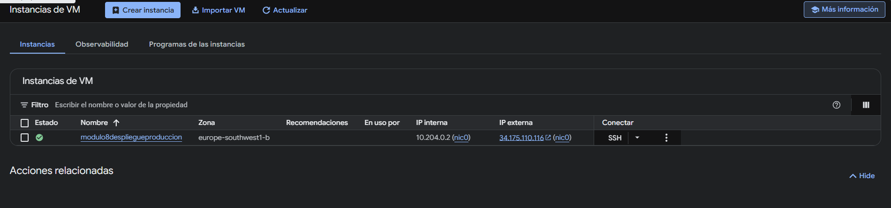
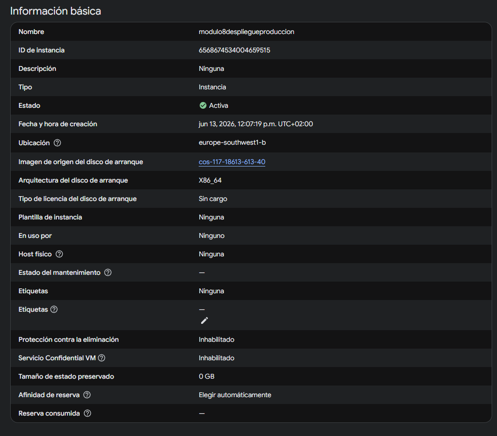
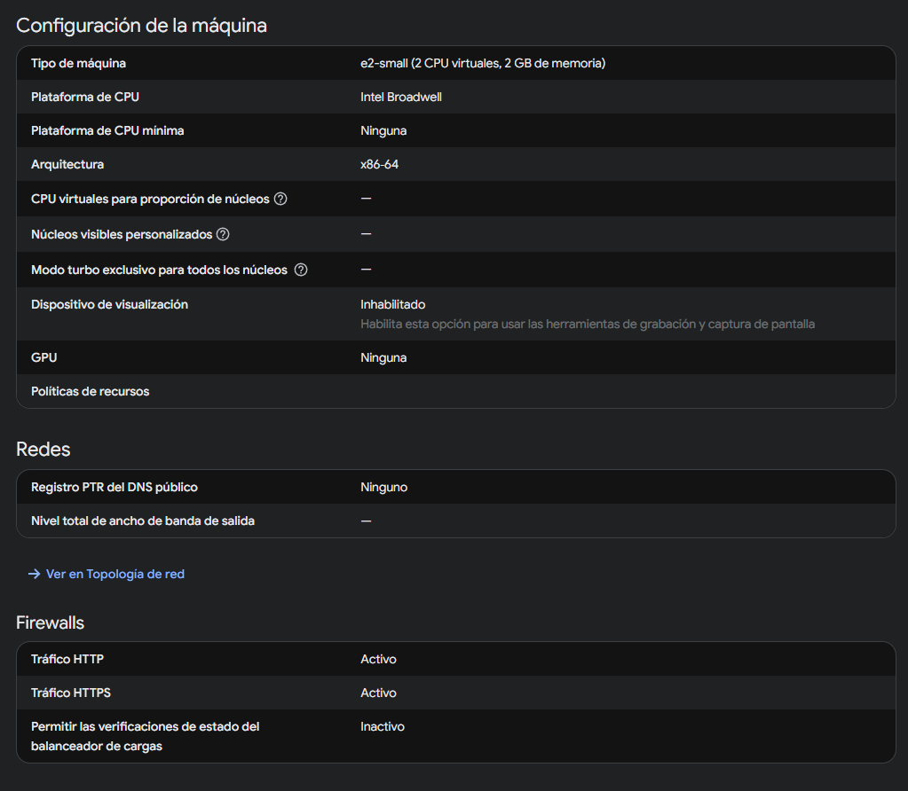
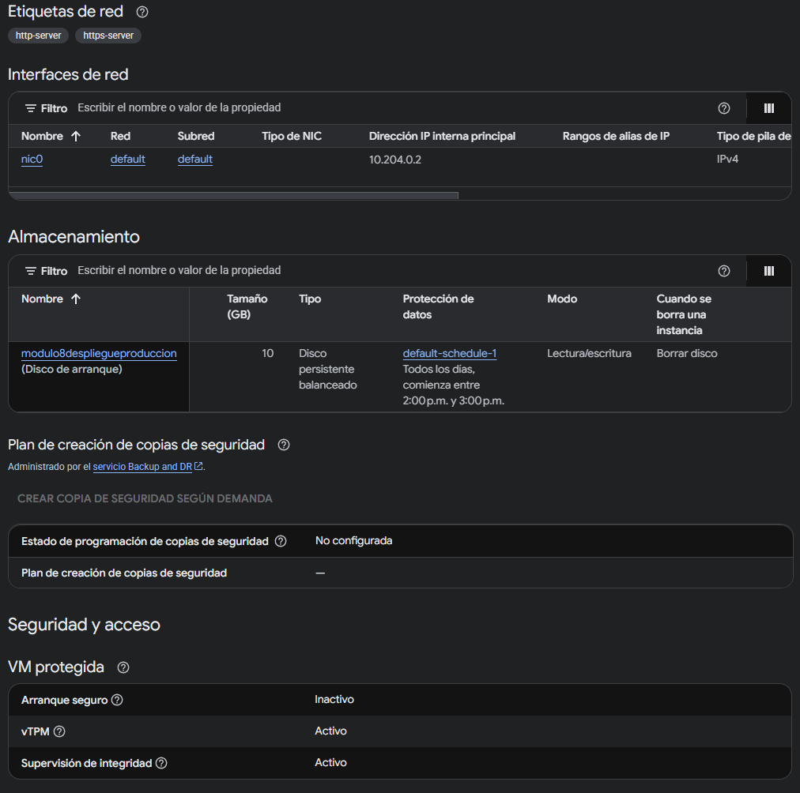
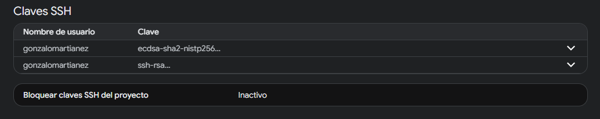

# Despliegue a producción - Compute Engine
Universidad Europea\
Despliegue a producción\
Ejercicio entregable de la Unidad 3\
Gonzalo Martínez Iáñez

Para ver el README.md de la entrega anterior consultar el commmit adc5ecf6016be68c10373597e9bb045a80771e75

### Memoria
En este ejercicio se pide subir la API usada en los ejercicios anteriores a una Instancia de máquina virtual de google usando Compute Engine. He añadido un nuevo endpoint llamado /health/ que no requiere autenticación. Como en el ejercicio anterior de integración continua ya lo configuré para que se subiera automáticamente la imagen de django al repositorio de contenedores de GitHub de forma pública. Una vez que se accede mediante ssh al servidor de google, con dos comandos ya se puede construir y ejecutar el contenedor.

### Pasos para levantar el contenedor en Compute Engine
Para configurar y desplegar la imagen hay que seguir los siguientes pasos:

Crear una cuenta en Compute Engine -> Habilitar Compute Engine API -> Crear instancia -> Nombre de la instancia y elegir Madrid como Región (por cercanía) -> Serie E para el tipo de máquina (e-2 small) -> pestaña de SO y almacenamiento -> Cambiar sistema operativo y almacenamiento -> Sistema Operativo: Container Optimized OS -> Pestaña de red -> Firewall: Permitir tráfico HTTP y HTTPS -> Crear la instancia
Acceder a la MV por SSH desde el navegador.

Introducir los siguientes comandos.
```bash
docker pull ghcr.io/gonzalomartinezianez/unidad5-clinica-django:1.2.6
docker images
docker run -d --name=clinica -p 80:8000 -e SECRET_KEY="clavesecreta" --restart always ghcr.io/gonzalomartinezianez/unidad5-clinica-django:1.2.6
```


Ahora hay que cambiar el tipo de IP externa de efíemera a estática, de esta forma google reserva esta IP y no variará con el tiempo:

Red de VPC -> Direcciones IP -> Acciones sobre la externa -> Proponer una IP estática -> Asignar nombre 



### Comprobación
Tras seguir estos pasos, se puede acceder a la url: http://34.175.110.116/health/ para comprobar que la API es accesible desde cualquier ordenador.


### Configuración final






