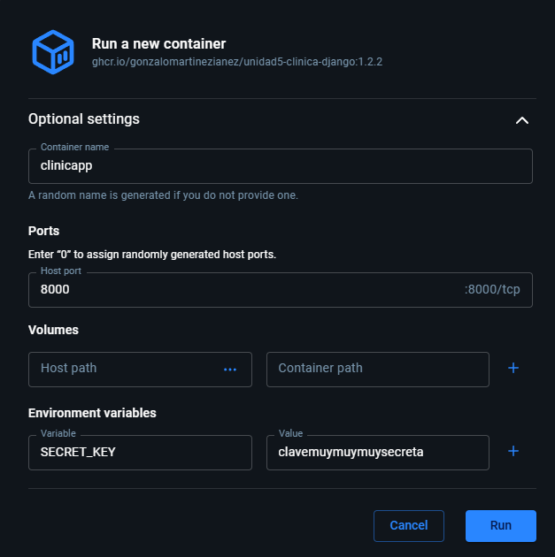
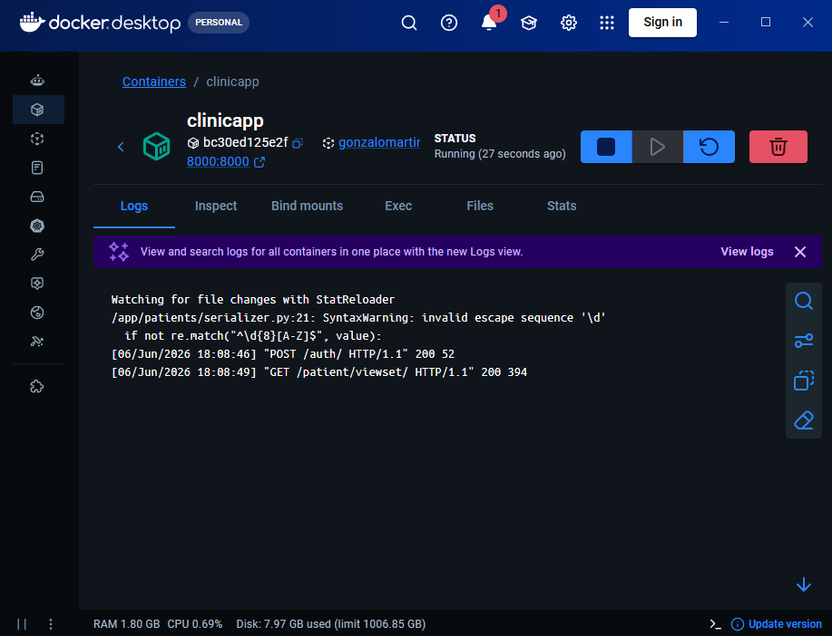

# Despliegue a producción - Compute Engine
Universidad Europea\
Despliegue a producción\
Ejercicio entregable de la Unidad 3\
Gonzalo Martínez Iáñez

Para ver el README.md de la entrega anterior consultar el commmit 4b44877

### Memoria


### Pasos para ejecutar la acción
Crear una cuenta en Compute Engine -> Habilitar Compute Engine API -> Crear instancia -> Nombre y elegir Madrid como Región -> Serie E para el tipo de máquina (e-2 small) -> pestaña de SO y almacenamiento -> Cambiar sistema operativo y almacenamiento -> Sistema Operativo: Container Optimized OS -> Pestaña de red -> Firewall: Permitir tráfico HTTP y HTTPS -> Crear la instancia
Acceder a la MV por SSH desde el navegador
```
docker pull ghcr.io/gonzalomartinezianez/unidad5-clinica-django:1.2.5
docker images
docker run -d --name=clinica -p 80:8000 -e SECRET_KEY="clavesecreta" --restart always ghcr.io/gonzalomartinezianez/unidad5-clinica-django:1.2.5
```


docker pull ghcr.io/gonzalomartinezianez/unidad5-clinica-django:1.2.4
```
En el apartado de Packages de la web, no hay ningún paquete, no sé si hay que hacer algo más o que tarda en actualizarse.

Para lanzar la imagen, he usado la siguiente configuración en docker desktop


### Comprobación
Para comprobar que ha funcionado correctamente se pueden probar los siguientes endpoints:
```
http://127.0.0.1:8000/auth/
body: 
    {
        "username": "Marta",
        "password": "recepcionista1234"    
    }
```
```
http://127.0.0.1:8000/patient/viewset/
Headers:
    Authorization       -       Token 7962a24bb2ddb298304cd1fcd9238217f7cf9c22
```
Los endpoints están funcionando correctamente


### Conclusión
